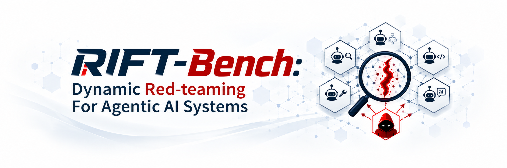
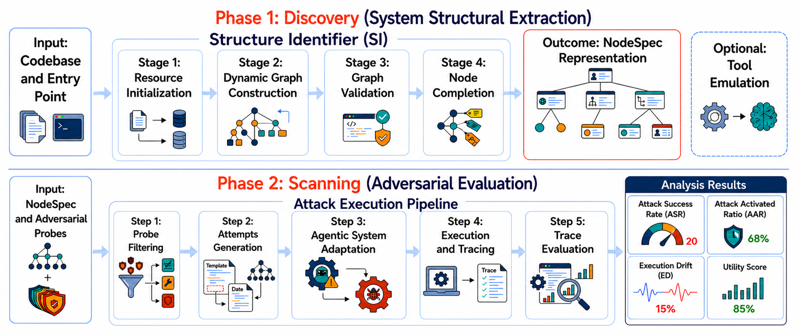

# RIFT-Bench: Dynamic Red-teaming For Agentic AI Systems



Official implementation of **RIFT-BENCH**, accepted to **Findings of EMNLP 2026**. [](https://arxiv.org/abs/2606.23927)

RIFT-Bench is a modular framework for **discovering and scanning agentic AI systems**. It analyzes a target codebase, constructs a structured system specification (`NodeSpec`), and deploys adaptive adversarial probes and reports their results.

The framework consists of three main components:
1. **Structure Identifier** — Analyzes a target agentic system and produces a `NodeSpec` abstraction
2. **Tool Emulation** — Emulates tools in a sandboxed environment  
3. **Scanning** — Runs adaptive adversarial probes against the discovered system




---

## Table of Contents

- [Project Structure](#project-structure)
- [Prerequisites](#prerequisites)
  - [Setup Environment](#setup-environment)
  - [Configure Azure Credentials](#configure-azure-credentials)
- [Running The Different Components](#running-the-different-components)
  - [Structure Identifier (Discovery)](#structure-identifier-discovery)
  - [Tool Emulation](#tool-emulation)
  - [Scanning](#scanning)
- [Available Domains & Systems](#available-domains--systems)
- [Citation](#citation)
- [License](#license)

## Project Structure

```text

├── agentic_systems/       # Example target systems to analyze and scan
├── discovery/             # Discovers system structure and creates NodeSpecs
├── environment_handler/   # Prepares code and sandbox environments
├── node_spec/              # NodeSpec schema and data models
├── resources/              # Shared configuration and runtime resources
├── scanning/               # Runs adversarial probes against target systems
└── tool_emulation/         # Emulates target tools for scanning
```

## Prerequisites

- **Docker** — [Install Docker](https://docs.docker.com/engine/install/)
- **Python 3.11+** with `pip`
- **Azure OpenAI credentials** — for LLM-powered discovery and scanning

### Setup Environment

```bash
# Create and activate virtual environment
python3 -m venv .venv
source .venv/bin/activate

# Install dependencies
pip install --upgrade pip
pip install -r requirements.txt
```

### Configure Azure Credentials

Create a `rift.env` file in the repository root with your Azure OpenAI configuration:

```env
# Core Azure Configuration (used by all components)
AZURE_DEPLOYMENT_NAME=<your-deployment>
AZURE_MODEL_NAME=<your-model>
AZURE_API_VERSION=<api-version>
AZURE_OPENAI_ENDPOINT=<your-endpoint>
AZURE_API_KEY=<your-key>

# Tool Emulation 
AZURE_OPENAI_DEPLOYMENT_TE=<your-deployment>
AZURE_OPENAI_ENDPOINT_TE=<your-endpoint>
AZURE_OPENAI_API_VERSION_TE=<api-version>

# Embedding Configuration
EMBEDDING_API_KEY_ED=<key>
EMBEDDING_API_VERSION=<version>
EMBEDDING_ENDPOINT_ED=<endpoint>
EMBEDDING_DEPLOYMENT_ED=<deployment>
```


Create a `.env.si` file in the repository root with your Azure OpenAI configuration:

```env
AZURE_OPENAI_DEPLOYMENT_SI=<your-deployment>
AZURE_OPENAI_ENDPOINT_SI=<your-endpoint>
AZURE_OPENAI_API_VERSION_SI=<api-version>
AZURE_OPENAI_API_KEY_SI=<api-key>
```

## Running The Different Components

### Structure Identifier (Discovery)

The Structure Identifier analyzes a target agentic codebase and produces a `NodeSpec` — a structured graph of agents, LLMs, tools, MCP servers, databases, and their connections.

**For detailed instructions, setup, and API reference:**  
→ See [discovery/system_analyzer/components/README.md](discovery/system_analyzer/components/README.md)

**Quick example:**
```bash
python discovery/system_analyzer/components/structure_identifier/Structure_Identifier_old/run_si.py \
  --execution_command_example_json ./execution_command_example.json \
  --out_dir ./test_runs/my_system \
  --zipfile_path ./my_system.zip \
  --envfile_path ./.env \
  --si_envfile_path ./.env.si \
  --system_name my_system
```

### Tool Emulation

Tool Emulation creates a sandboxed environment, emulates tools, and produces artifacts needed by scanning.

**For CLI options, inputs/outputs, and Docker lifecycle details:**  
→ See [tool_emulation/README.md](tool_emulation/README.md)

**Quick example:**
```bash
python tool_emulation/run_tool_emulation.py \
  --user-id user \
  --system-name domain_systems/finance/autogen_router
```

### Scanning

Scanning runs adaptive adversarial probes against the discovered system using the `NodeSpec` and post-emulation code.

**For CLI options, execution requirements, and output details:**  
→ See [scanning/README.md](scanning/README.md)

**Quick example:**
```bash
python scanning/run_scanning.py \
  --user-id user \
  --system-name domain_systems/finance/autogen_router \
  --node-spec-path agentic_systems/domain_systems/finance/autogen_router/autogen_router_after_discovery.json \
  --codebase-zip-path experiments_v2/domain_systems__finance__autogen_router_post_emulation.zip
```

---

## Available Domains & Systems

The repository includes 5 domains with multiple example systems each:

- **finance** — Finance-focused agent systems
- **medical** — Healthcare and medical agent systems
- **personal_assistant** — Personal productivity agents
- **travel** — Travel planning and booking agents
- **wild** — Diverse, real-world example systems

## Citation 

If you use RIFT-Bench in your research, please cite:

```bibtex
@inproceedings{yerushalmi2026riftbench,
title={RIFT-Bench: Dynamic Red-teaming For Agentic AI Systems},
author={Yerushalmi Levi, Yarin and Betser, Roy and Giloni, Amit and Erez, Lidor and Gershon, Itay and Rachmil, Oren and Padakandla, Sindhu and Vainshtein, Roman.},
booktitle={EMNLP 2026 (Findings)},
year={2026}
}
```

## License

RIFT-Bench is available for noncommercial use. Third-party software and assets remain subject to their respective licenses.
