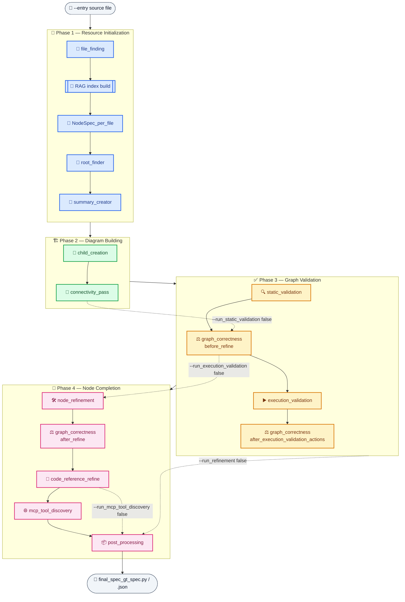

# 🧠 Structure Identifier

**Structure Identifier** turns an arbitrary Python agentic codebase into a validated, structured
**NodeSpec graph** 🕸️ — a typed description of every agent, LLM, tool, MCP server, and data store
in the system, how they're wired together, and what they actually do at runtime.

It works by running a long chain of small, focused stages. Each stage reads the previous stage's
output file(s) from one shared `--discovery-results-dir`, does one job, and writes its own output file(s) back
into that same directory. Stages can be run all at once through the orchestrator
(`run_pipeline.py`), or individually through each stage's own `main.py` — which makes the whole
pipeline easy to resume, debug, or re-run partially.

The repo contains its own ready-made test bed for this: `agentic_systems/domain_systems/` contains **5
domains** — `finance`, `medical`, `personal_assistant`, `travel`, and `wild` — with **9 agentic
systems each** (45 total). The first four domains are a systematic grid of every
framework × architecture combination (`autogen`/`crewai`/`langraph` × `agent`/`orch`/`router`);
`wild` is instead 9 distinct, irregular agentic systems (mostly pulled from public examples
across different frameworks and shapes). Together they're a broad, ready-to-run corpus for testing
and evaluating Structure Identifier itself against.

---

## 📚 Table of contents

- [🚀 Quick start](#quick-start)
- [🧭 Running the full pipeline](#running-the-full-pipeline)
- [⚙️ How the pipeline works under the hood](#how-it-works)
- [🗺️ Pipeline flow diagram](#pipeline-flow-diagram)
- [📋 Stage overview](#stage-overview)
- [🗂️ Output directory layout](#output-directory-layout)
- [🔬 Stage details](#stage-details)
  1. [📂 `file_finding`](#stage-1-file-finding)
  2. [🧩 `NodeSpec_per_file`](#stage-2-nodespec-per-file)
  3. [🌳 `root_finder`](#stage-3-root-finder)
  4. [📝 `summary_creator`](#stage-4-summary-creator)
  5. [👶 `child_creation`](#stage-5-child-creation)
  6. [🔗 `connectivity_pass`](#stage-6-connectivity-pass)
  7. [🔍 `static_validation`](#stage-7-static-validation)
  8. [⚖️ `graph_correctness`](#stage-8-graph-correctness)
  9. [▶️ `execution_validation`](#stage-9-execution-validation)
  10. [🛠️ `node_refinement`](#stage-10-node-refinement)
  11. [📎 `code_reference_refine`](#stage-11-code-reference-refine)
  12. [🌐 `mcp_tool_discovery`](#stage-12-mcp-tool-discovery)
  13. [📦 `post_processing`](#stage-13-post-processing)
- [🧰 Support packages](#support-packages)
- [⚠️ Common pitfalls](#common-pitfalls)
- [🐞 Suggested debugging workflow](#debugging-workflow)

---

<a id="quick-start"></a>

## 🚀 Quick start

```bash
SYSTEM_NAME="my_system"
CODEBASE_ZIP="./path/to/codebase.zip"
EXECUTION_EXAMPLE="./path/to/execution_command_example.json"
TARGET_ENV_FILE="./path/to/target.env"
SI_ENV_FILE="./.env.si"
OUT_DIR="./test_runs/${SYSTEM_NAME}"

python discovery/system_analyzer/components/structure_identifier/run_si.py \
  --execution-command-example-json "$EXECUTION_EXAMPLE" \
  --discovery-results-dir "$OUT_DIR" \
  --codebase-zip-path "$CODEBASE_ZIP" \
  --env-file-path "$TARGET_ENV_FILE" \
  --si-env-file-path "$SI_ENV_FILE" \
  --system-name "$SYSTEM_NAME"
```

This runs every stage end-to-end and leaves the final graph at:

```text
discovery/system_analyzer/components/structure_identifier/test_outputs/finance_langraph_agent/final_spec_gt_spec.py
discovery/system_analyzer/components/structure_identifier/test_outputs/finance_langraph_agent/final_spec_gt_spec.json   # after executing the .py once, see §13
```

---

<a id="running-the-full-pipeline"></a>

## 🧭 Running the full pipeline

`run_pipeline.py` is the orchestrator. It shells out to each stage's `main.py` as a subprocess
(`python -m discovery.system_analyzer.components.structure_identifier.<stage>.main ...`), validates that each stage produced its
required output file(s) before continuing, and can retry a failed stage once with `--refresh-raw`
forced on.

None of `run_pipeline.py`'s own flags are `required=True` at the argparse level — every one has a
default — but `--entrypoint-path` and `--discovery-results-dir` are the two you always want to set explicitly for a
meaningful run.

### Top-level flags

| Flag | Required? | Default | Description |
|---|---|---|---|
| `--python` | optional | `sys.executable` | Interpreter used to invoke every stage subprocess. |
| `--env-file-path` | optional | `.env` | Env file loaded by the orchestrator and passed to every stage. |
| `--entrypoint-path` | optional *(always set in practice)* | `agentic_systems/domain_systems/finance/autogen_agent/main.py` | The target system's entrypoint source file. |
| `--codebase-zip-path` | optional | *(empty → `<entry_parent>.zip`)* | Optional zip for sandbox execution/tracing. |
| `--discovery-results-dir` | optional *(always set in practice)* | `stages_outputs` | Shared output directory for every stage's artifacts. |
| `--root-out` | optional | `root_record.json` | Root-record filename under `--discovery-results-dir`. |
| `--reachable-out` | optional | `reachable_files.json` | Reachable-files filename under `--discovery-results-dir`. |
| `--nodes-index` | optional | `nodes_index.json` | Per-file nodes index filename under `--discovery-results-dir`. |
| `--nodes-catalog` | optional | `nodes_catalog.py` | Combined catalog filename under `--discovery-results-dir`. |
| `--root-nodes` | optional | `root_nodes.json` | Root nodes filename under `--discovery-results-dir`. |
| `--guidance-file` | optional | `system_guidance.json` | Declared but **not actually passed** to `summary_creator` — effectively unused (see §4). |
| `--nodes-with-children` | optional | `nodes_with_children.py` | Child-expanded nodes filename under `--discovery-results-dir`. |
| `--nodes-connected` | optional | `nodes_connected.py` | Connected nodes filename under `--discovery-results-dir`. |
| `--rag-repo-root` | optional | `.` | Repo root indexed for retrieval. |
| `--rag-index-dir` | optional | `rag_index` | Where the FAISS index is written (relative → under `--discovery-results-dir`). |
| `--rag-max-rounds` | optional | `8` | Max per-call context-request rounds against the retriever. |
| `--model` | optional | `gpt-5.2-codex` | Model used by every LLM-backed stage. |
| `--execution-validation-max-rounds` | optional | `3` | Retained for compatibility; see §9. |
| `--stop-early` | optional (flag) | off | Exit early at the current dev checkpoint. |
| `--final-nodespec` | optional | `final_nodespec.py` | `code_reference_refine`'s output filename. |
| `--final-report` | optional | `final_report.json` | `code_reference_refine`'s final report filename. |
| `--final-output-stem` | optional | `final_spec_gt_spec` | Base filename for `post_processing`'s final export. |
| `--hints-file` | optional *(repeatable)* | `[]` | Manual hints file(s) for `file_finding`. |
| `--execution-command-example-json` | optional *(needed for a live run)* | *(empty)* | Path to a JSON describing how to actually **run** the target (runner/entrypoint/args) — required in practice for `execution_validation` and `mcp_tool_discovery` to do anything live. |
| `--graph-correctness-system-summary-pass-phases` | optional | `none` | Comma-separated subset of `before_refine,after_refine,after_execution_validation_actions,all,none`. |
| `--run-static-validation` | optional | `true` | Toggle for §7. |
| `--run-execution-validation` | optional | `true` | Toggle for §9 (+ its own graph-correctness re-pass). |
| `--run-refinement` | optional | `true` | Toggle for §10–§11 as a bundle. |
| `--run-mcp-tool-discovery` | optional | `true` | Toggle for §12; only takes effect when `--run-refinement` is also on. |
| `--refresh-raw` | optional (flag) | off | Bypass every stage's LLM response cache. |

### A fuller example

```bash
SYSTEM_NAME="my_system"
CODEBASE_ZIP="./path/to/codebase.zip"
EXECUTION_EXAMPLE="./path/to/execution_command_example.json"
TARGET_ENV_FILE="./path/to/target.env"
SI_ENV_FILE="./.env.si"
OUT_DIR="./test_runs/${SYSTEM_NAME}"
MODEL="your-model-deployment"

python discovery/system_analyzer/components/structure_identifier/run_si.py \
  --execution-command-example-json "$EXECUTION_EXAMPLE" \
  --discovery-results-dir "$OUT_DIR" \
  --codebase-zip-path "$CODEBASE_ZIP" \
  --env-file-path "$TARGET_ENV_FILE" \
  --si-env-file-path "$SI_ENV_FILE" \
  --system-name "$SYSTEM_NAME" \
  --model "$MODEL"
```

---

<a id="how-it-works"></a>

## ⚙️ How the pipeline works under the hood

Four cross-cutting mechanisms apply to *every* stage the orchestrator runs. They're implemented
once in `run_pipeline.py`/`global_utils.py`/`model_client.py` rather than per-stage, which is why
individual stage sections below don't repeat them.

### ✅ Output verification after every stage

Every stage call is wrapped by `_run_validated_stage(...)`, which:

1. Runs the stage as a subprocess.
2. Validates its declared `required_outputs` — each one checked by a kind-specific validator:
   - `file_exists` — the file is present.
   - `json` — parses as JSON, is an object, and has any required top-level keys.
   - `root_json` — the above, plus contains a usable root-node object.
   - `nodes_py` — loads via `load_nodes_by_var` into a non-empty, internally-consistent node graph.
3. **On failure**, if the stage supports it (`supports_refresh_raw=True`), retries once with
   `--refresh_raw` forced on (bypassing every LLM cache) before giving up.
4. **If still failing**, one of two things happens depending on the stage's `failure_policy`:
   - `required` (most stages) — raises and stops the whole pipeline run.
   - `fallback_to_input` (every `graph_correctness` call + `mcp_tool_discovery`) — falls back to
     that stage's own pre-run input file and continues, so one bad structural pass or one
     unreachable MCP server never kills an otherwise-good run.

Every attempt (success or failure) is recorded into `pipeline_report.json` at the end of the run.

### ⏱️ Latency tracking

Every subprocess call is timed. After **each** step (not just at the end), the running total and
per-step breakdown are flushed to `<out_dir>/pipeline_latency.json`:

```json
{
  "total_seconds": 812.4,
  "steps": [
    {"step": "file_finding", "seconds": 3.1, "ok": true},
    {"step": "graph_correctness:before_refine", "seconds": 96.7, "ok": true}
  ]
}
```

Multi-phase stages (`graph_correctness`, `node_refinement`) are disambiguated by their `--phase`
value in the step label, exactly like above — this is the same label used in `llm_usage.jsonl`,
so the two files line up per stage invocation.

### 💰 Cost / token-usage tracking

Every individual LLM call (from any stage) appends one line to `<out_dir>/llm_usage.jsonl`:

```json
{"ts": 1784826270.906, "pid": 83247, "stage": "NodeSpec_per_file", "model": "gpt-5.2-codex",
 "latency_sec": 7.694, "input_tokens": 2416, "output_tokens": 584, "total_tokens": 3000,
 "cached_input_tokens": 2048, "reasoning_tokens": 128}
```

`stage` is derived automatically from the calling script's own filename (and `--phase`, if
present), no stage has to opt in or configure this itself. Summing `total_tokens`/`latency_sec`
across this file is the standard way to answer "what did this run cost / where did the time go?"
per stage, independent of the coarser wall-clock view in `pipeline_latency.json`.

### 🔎 The shared LLM + RAG call pattern

Nearly every LLM call in every stage goes through the same two helpers in `global_utils.py`:
`call_with_cache` / `call_with_cache_text`. Both:

- Write the outgoing payload and check it against any existing cached payload/response pair on
  disk under that stage's `*_raw/` directory — an identical payload short-circuits to the cached
  response instead of calling the model again (this is what `--refresh_raw` bypasses).
- If a retriever was loaded (`rag.build_retriever.load_retriever`), route the call through
  `rag.context_request.run_task_with_rag` instead of calling the model directly — this lets the
  model request additional repo context **mid-call**, for up to that stage's own `--rag_max_rounds`
  rounds, before giving its final answer.
- Otherwise call `model_client.call_model` directly.

This is why almost every stage's CLI has both a `--raw_dir` (the on-disk cache) and a
`--rag_index_dir`/`--rag_max_rounds` pair (the shared retrieval loop): they're the same mechanism
reused everywhere, not something each stage reimplements.

---

<a id="pipeline-flow-diagram"></a>

## 🗺️ Pipeline flow diagram

The pipeline runs in four phases. Solid arrows always execute; dashed arrows are the skip-path
taken when the labeled flag disables that segment.



| Phase | Stages | Always run? |
|---|---|---|
| 🧱 **1 — Resource Initialization** | `file_finding` → RAG index build → `NodeSpec_per_file` → `root_finder` → `summary_creator` | ✅ always |
| 🏗️ **2 — Diagram Building** | `child_creation` → `connectivity_pass` | ✅ always |
| ✅ **3 — Graph Validation** | `static_validation` *(optional)* → `graph_correctness` → `execution_validation` *(optional)* → `graph_correctness` | ⚖️ `graph_correctness` always runs; the other two are individually gated |
| 🎯 **4 — Node Completion** | `node_refinement` → `graph_correctness` → `code_reference_refine` → `mcp_tool_discovery` *(optional)* → `post_processing` | 🧩 the first four are bundled behind `--run_refinement`; `post_processing` always runs |

---

<a id="stage-overview"></a>

## 📋 Stage overview

| # | Phase | Stage | One-line purpose | Key output |
|---|---|---|---|---|
| 1 | 🧱 | 📂 [`file_finding`](#stage-1-file-finding) | Discovers the reachable file set from `--entry`. | `reachable_files.json`, `root_record.json` |
| — | 🧱 | 🔎 *(RAG index build)* | Indexes the repo for retrieval-augmented LLM calls. | `rag_index/` |
| 2 | 🧱 | 🧩 [`NodeSpec_per_file`](#stage-2-nodespec-per-file) | Extracts candidate NodeSpec nodes per file via LLM. | `nodes_catalog.py` |
| 3 | 🧱 | 🌳 [`root_finder`](#stage-3-root-finder) | Picks the single graph root node. | `root_nodes.json` |
| 4 | 🧱 | 📝 [`summary_creator`](#stage-4-summary-creator) | Writes a system-level guidance summary. | `system_guidance.json` |
| 5 | 🏗️ | 👶 [`child_creation`](#stage-5-child-creation) | Expands the root into a full parent/child tree. | `nodes_with_children.py` |
| 6 | 🏗️ | 🔗 [`connectivity_pass`](#stage-6-connectivity-pass) | Repairs/completes graph edges. | `nodes_connected.py` |
| 7 | ✅ | 🔍 [`static_validation`](#stage-7-static-validation) *(optional)* | Reconciles the catalog against the graph; splits main vs. isolated nodes. | `static_validation_nodes_main_graph.py` |
| 8 | ✅ | ⚖️ [`graph_correctness`](#stage-8-graph-correctness) *(×3)* | Structural rule pass (orphans, collapsing, MCP shape, etc.). Reused after static validation, execution validation, and refinement. | `*_graph_corrected.py` |
| 9 | ✅ | ▶️ [`execution_validation`](#stage-9-execution-validation) *(optional)* | Actually runs the target system, parses runtime traces, adds validated components. | `post_execution_validation_actions.py` |
| 10 | 🎯 | 🛠️ [`node_refinement`](#stage-10-node-refinement) *(bundled)* | Fills in and normalizes every node's fields. | `post_refinement_nodes.py` |
| 11 | 🎯 | 📎 [`code_reference_refine`](#stage-11-code-reference-refine) *(bundled)* | Grounds/regrounds code references, incl. MCP constructor snippets. | `final_nodespec.py` |
| 12 | 🎯 | 🌐 [`mcp_tool_discovery`](#stage-12-mcp-tool-discovery) *(optional)* | Connects to live `External_MCP_server`s and replaces `tool_list` with real discovered tools. | `mcp_tool_discovery_nodes.py` |
| 13 | 🎯 | 📦 [`post_processing`](#stage-13-post-processing) | Assembles, validates, and renders the final exported spec. | `final_spec_gt_spec.py` / `.json` |

---

<a id="output-directory-layout"></a>

## 🗂️ Output directory layout

This is the real layout of a completed `--out_dir` (`discovery/system_analyzer/components/structure_identifier/test_outputs/finance_autogen_orch/`
after a full run), directories first, then files:

```text
<out_dir>/
  child_creation_raw/
  code_reference_refine_raw/
  connectivity_raw/
  execution_validation/
    execution_validation_runs/
      custom/                              (or use_case_<n>/)
        run_NNN.prompt.txt
        run_NNN.trace_path.txt
        run_NNN.llm_span_pipeline.json
        run_NNN.llm_span_pipeline.debug.json
        traces/
        name_mapping_expected/
        inventory_parse/
        inventory_name_mapping/
  graph_correctness_raw_post_execution_validation/
  graph_correctness_raw_post_refinement/
  graph_correctness_raw_post_static_validation/
  guidance_raw/
  mcp_tool_discovery_raw/
  node_refinement_raw_post/
  nodes_per_file_outputs/
  nodes_per_file_raw/
  rag_index/
  root_finder_raw/
  static_validation_raw/
  validation/
    execution_validation_report_post_static_validation.json
    runtime_mapping.json
  NodeSpec_schema.py
  code_reference_refine_report.json
  execution_command_example.json
  final_nodespec.py
  final_report.json
  final_spec_gt_spec.json
  final_spec_gt_spec.py
  graph_correctness_verified_rules.json
  llm_usage.jsonl
  mcp_tool_discovery_nodes.py
  mcp_tool_discovery_report.json
  nodes_catalog.py
  nodes_connected.py
  nodes_identity_map.json
  nodes_index.json
  nodes_per_file_report.json
  nodes_with_children.py
  pipeline_latency.json
  pipeline_report.json
  post_execution_validation_action_apply_report.json
  post_execution_validation_actions.py
  post_execution_validation_graph_corrected.py
  post_execution_validation_graph_correctness_report.json
  post_refinement_graph_corrected.py
  post_refinement_graph_correctness_report.json
  post_refinement_node_refinement_report.json
  post_refinement_nodes.py
  post_static_validation_graph_corrected.py
  post_static_validation_graph_correctness_report.json
  reachable_files.json
  root_nodes.json
  root_nodes.py
  root_record.json
  run_info.json
  static_validation_isolation_report.json
  static_validation_nodes_isolated.py
  static_validation_nodes_main_graph.py
  system_guidance.json
```

> [!NOTE]
> A stray `__pycache__/` also shows up in real runs (from Python importing the copied
> `NodeSpec_schema.py`) — it's compiler noise, not a pipeline artifact, and is omitted above.

### What each directory is

| Directory | Produced by | What's in it |
|---|---|---|
| `child_creation_raw/` | §5 | Per-parent raw LLM payload/response pairs from child discovery. |
| `code_reference_refine_raw/` | §11 | Per-node raw LLM traces for code-reference grounding. |
| `connectivity_raw/` | §6 | Per-parent raw LLM traces under `pass_dynamic/<parent>/` from edge repair. |
| `execution_validation/` | §9 | Everything from actually running the target: `execution_validation_runs/<label>/` holds one `run_NNN.*` file set per validation attempt (prompt sent, trace pointer, canonical parsed events, debug dump), plus `traces/` (raw exported MLflow traces) and the name/inventory-mapping subfolders used while resolving runtime aliases. |
| `graph_correctness_raw_post_execution_validation/`, `_post_refinement/`, `_post_static_validation/` | §8 | One raw-trace folder per `graph_correctness` invocation (`rules_round_NN/`), keyed by which of the three call sites produced it. |
| `guidance_raw/` | §4 | The single raw LLM call/response for the system-guidance summary. |
| `mcp_tool_discovery_raw/` | §12 | Per-server subfolder, each holding every probe attempt's generated resolver body, spliced script, and execution result. |
| `node_refinement_raw_post/` | §10 | Per-node raw traces for each of the three refinement phases, plus `_phase2_existence_resolution/` for removal decisions. |
| `nodes_per_file_outputs/` | §2 | One rendered `.py` per source file, each holding that file's extracted candidate nodes before combination. |
| `nodes_per_file_raw/` | §2 | Raw per-file LLM payload/response pairs behind `nodes_per_file_outputs/`. |
| `rag_index/` | RAG index build | The persisted FAISS index (+ metadata) that every later stage's retriever loads. |
| `root_finder_raw/` | §3 | Raw LLM traces for both the per-file candidate selection and the pairwise root comparisons. |
| `static_validation_raw/` | §7 | Per-catalog-node raw LLM traces, one retry round at a time. |
| `validation/` | §9 | `execution_validation_report_post_static_validation.json` (the full existence-validation report) and `runtime_mapping.json` (the induced runtime alias registry, later attached to the root node by §13). |

### What each file is

| File | Produced by | What it is |
|---|---|---|
| `NodeSpec_schema.py` | copied by several stages | A working copy of the schema, alongside the graph files so they can be loaded/rendered independently. |
| `code_reference_refine_report.json` | §11 | Before/after code-reference counts and per-node grounding outcomes. |
| `execution_command_example.json` | orchestrator | A persisted copy of whatever `--execution_command_example_json` pointed at, for reproducibility. |
| `final_nodespec.py` | §11 | The code-reference-refined graph — input to §12/§13. |
| `final_report.json` | §11 | `code_reference_refine`'s own summary report (distinct from `code_reference_refine_report.json`). |
| `final_spec_gt_spec.py` / `.json` | §13 | **The pipeline's end deliverable** — the fully validated, exported NodeSpec graph (see the important note in §13 about how the `.json` gets (re)written). |
| `graph_correctness_verified_rules.json` | §8 | Cross-phase cache of previously-resolved single-child/multi-parent decisions. |
| `llm_usage.jsonl` | every stage | Per-LLM-call token/latency records — see [⚙️ How the pipeline works under the hood](#how-it-works). |
| `mcp_tool_discovery_nodes.py` | §12 | The graph after live tool discovery — input to §13 when §12 ran. |
| `mcp_tool_discovery_report.json` | §12 | Per-server `ok`/`error`/`skipped_no_constructor_ref` outcomes. |
| `nodes_catalog.py` | §2 | The combined per-file node catalog (`ALL_NODES`). |
| `nodes_connected.py` | §6 | The graph after edge repair — input to §7/§8. |
| `nodes_identity_map.json` | §2 | Stable var-name identity map so reruns keep the same node variable names. |
| `nodes_index.json` | §2 | Per-file index pointing at each file's entry in `nodes_per_file_outputs/`. |
| `nodes_per_file_report.json` | §2 | Per-file extraction outcomes/retry counts. |
| `nodes_with_children.py` | §5 | The graph after child expansion — input to §6. |
| `pipeline_latency.json` | orchestrator | Per-step wall-clock timings + running total — see [⚙️ How the pipeline works under the hood](#how-it-works). |
| `pipeline_report.json` | orchestrator | The full stage-by-stage run report (every `_run_validated_stage` attempt/outcome). |
| `post_execution_validation_action_apply_report.json` | §9 | What `apply_validation_additions` actually added to the graph. |
| `post_execution_validation_actions.py` | §9 | The graph after applying validated runtime discoveries — input to §8 (site 2). |
| `post_execution_validation_graph_corrected.py` | §8 (site 2) | Graph-correctness output after execution validation — input to §10 when §9 ran. |
| `post_execution_validation_graph_correctness_report.json` | §8 (site 2) | That pass's rule-by-rule report. |
| `post_refinement_graph_corrected.py` | §8 (site 3) | Graph-correctness output after refinement — input to §11. |
| `post_refinement_graph_correctness_report.json` | §8 (site 3) | That pass's rule-by-rule report. |
| `post_refinement_node_refinement_report.json` | §10 | Per-node refinement outcomes. |
| `post_refinement_nodes.py` | §10 | The graph after field refinement — input to §8 (site 3). |
| `post_static_validation_graph_corrected.py` | §8 (site 1) | Graph-correctness output after static validation — input to §9 (or §10 if §9 is skipped). |
| `post_static_validation_graph_correctness_report.json` | §8 (site 1) | That pass's rule-by-rule report. |
| `reachable_files.json` | §1 | The reachable-file inventory. |
| `root_nodes.json` | §3 | The chosen root node (canonical; other stages' `--root_json` points here). |
| `root_nodes.py` | §3 | A human-readable `NodeSpec(...)` rendering of just the root node. |
| `root_record.json` | §1 | `project_root`/`entry_abs`/`entry_rel` bookkeeping. |
| `run_info.json` | orchestrator | The resolved entry/out_dir/model and other run-level settings for this invocation. |
| `static_validation_isolation_report.json` | §7 | Which catalog nodes were added, matched, or left isolated. |
| `static_validation_nodes_isolated.py` | §7 | Nodes that remain genuinely isolated (informational; not fed forward). |
| `static_validation_nodes_main_graph.py` | §7 | The reconciled main graph — input to §8 (site 1). |
| `system_guidance.json` | §4 | The system-level guidance summary consumed by §5/§6. |

---

<a id="stage-details"></a>

## 🔬 Stage details

<a id="stage-1-file-finding"></a>

### 1. 📂 `file_finding`

**Role.** The very first stage. Starting from a single entrypoint file, it walks imports,
string-literal path references, and dynamic sibling-file scans (BFS) to build the initial file
inventory every later stage works from. Pure static analysis — no LLM calls.

**CLI** — none of this stage's flags are `required=True`; every one has a default.

| Flag | Required? | Default |
|---|---|---|
| `--env_file` | optional | `.env` |
| `--entry` | optional *(always set in practice)* | `agent_scripts/langraph_react_agent.py` |
| `--out_dir` | optional *(always set in practice)* | `<repo>/stages_outputs` |
| `--root_out` | optional | `root_record.json` |
| `--reachable_out` | optional | `reachable_files.json` |
| `--hints_file` | optional *(repeatable)* | `[]` |

**Outputs.** `root_record.json` (`--root_out`) and `reachable_files.json` (`--reachable_out`),
both under `--out_dir`.

```bash
python3 -m discovery.system_analyzer.components.structure_identifier.file_finding.main \
  --entry ./path/to/entrypoint.py \
  --out_dir ./test_runs/my_system \
  --root_out root_record.json \
  --reachable_out reachable_files.json
```

---

<a id="stage-2-nodespec-per-file"></a>

### 2. 🧩 `NodeSpec_per_file`

**Role.** Runs one LLM extraction call per reachable file to propose candidate NodeSpec nodes, then
combines every per-file result into one deterministic catalog (`nodes_catalog.py`) that everything
downstream treats as the ground inventory of "things that might be nodes."

**CLI** — no flag is `required=True`.

| Flag | Required? | Default |
|---|---|---|
| `--env_file` | optional | `.env` |
| `--out_dir` | optional *(always set in practice)* | `<repo>/stages_outputs` |
| `--reachable_record` | optional | `reachable_files.json` |
| `--index_file` | optional | `nodes_index.json` |
| `--combined_out` | optional | `nodes_catalog.py` |
| `--identity_map` | optional | `nodes_identity_map.json` |
| `--model` | optional | `$CODEX_MODEL` or `gpt-5.2-codex` |
| `--execution_command_example_json` | optional | *(empty)* |
| `--max_file_bytes` | optional | `50000` |
| `--max_output_retries` | optional | `3` |
| `--prompt` | optional | *(empty)* |
| `--refresh_raw` / `--refresh-raw` | optional (flag) | off |

**Behavior.** One `call_model` per file, wrapped in a repair loop that re-prompts on malformed
`NEW_NODES` output (falling back to an empty stub after exhausting retries). Per-file raw outputs
are cached on disk, so reruns are cheap unless `--refresh_raw` is set.

**Outputs.** `nodes_index.json` (`--index_file`), `nodes_catalog.py` (`--combined_out`),
`nodes_identity_map.json` (`--identity_map`), one rendered `.py` per source file under
`nodes_per_file_outputs/`, raw LLM traces under `nodes_per_file_raw/`, and `nodes_per_file_report.json`.

```bash
python3 -m discovery.system_analyzer.components.structure_identifier.NodeSpec_per_file.main \
  --out_dir ./test_runs/my_system \
  --reachable_record reachable_files.json \
  --index_file nodes_index.json \
  --combined_out nodes_catalog.py \
  --model gpt-5.2-codex
```

---

<a id="stage-3-root-finder"></a>

### 3. 🌳 `root_finder`

**Role.** Chooses the single top-level "root" node of the whole graph. Picks a best local candidate
per source file, then runs pairwise LLM comparisons across files' winners until one root remains.

**CLI** — no flag is `required=True`.

| Flag | Required? | Default |
|---|---|---|
| `--env_file` | optional | `.env` |
| `-f` / `--entry` | optional *(always set in practice)* | `agentic_systems/domain_systems/finance/autogen_agent/main.py` |
| `--nodes_index` | optional | `nodes_index.json` |
| `--out_dir` | optional *(always set in practice)* | `<repo>/stages_outputs` |
| `--raw_dir` | optional | `root_finder_raw` |
| `--model` | optional | `$CODEX_MODEL` or `gpt-5.2-codex` |
| `--rag_index_dir` | optional | `rag_index` |
| `--rag_max_rounds` | optional | `6` |
| `--refresh_raw` / `--refresh-raw` | optional (flag) | off |

**Behavior.** RAG-grounded at both the per-file candidate-selection step and the pairwise
comparison step. The output filename is **hardcoded** to `root_nodes.json` — there's no
`--root_nodes`-style flag on this stage itself (the orchestrator's own `--root_nodes` flag is only
used afterward to optionally copy that canonical file to a different requested name).

**Outputs.** `root_nodes.json` and a human-readable `root_nodes.py` rendering of the root node
(both hardcoded filenames, always at `--out_dir` root), plus raw LLM traces under `--raw_dir`
(`root_finder_raw`).

```bash
python3 -m discovery.system_analyzer.components.structure_identifier.root_finder.main \
  --entry ./path/to/entrypoint.py \
  --out_dir ./test_runs/my_system \
  --nodes_index nodes_index.json \
  --raw_dir root_finder_raw \
  --rag_index_dir ./test_runs/my_system/rag_index \
  --model gpt-5.2-codex
```

---

<a id="stage-4-summary-creator"></a>

### 4. 📝 `summary_creator`

**Role.** Produces one natural-language "system guidance" summary of the whole graph, grounded in
the root node's code evidence. `child_creation` and `connectivity_pass` both read this file (if
present) as extra context for their own LLM prompts.

**CLI** — no flag is `required=True`.

| Flag | Required? | Default |
|---|---|---|
| `--env_file` | optional | `.env` |
| `--out_dir` | optional *(always set in practice)* | `<repo>/stages_outputs` |
| `--root_nodes_file` | optional | `root_nodes.json` |
| `--nodes_file` | optional | `nodes_catalog.py` |
| `--raw_dir` | optional | `guidance_raw` |
| `--model` | optional | `$CODEX_MODEL` or `gpt-5.2-codex` |
| `--rag_index_dir` | optional | `rag_index` |
| `--rag_max_rounds` | optional | `6` |
| `--refresh_raw` / `--refresh-raw` | optional (flag) | off |

> [!NOTE]
> This stage's output path is **hardcoded** to `<out_dir>/system_guidance.json`. The
> orchestrator's own `--guidance_file` flag (default `system_guidance.json`) exists but is never
> actually passed down to this stage — it's effectively unused, and only "works" today because its
> default happens to match the hardcoded name.

**Behavior.** A single RAG-grounded LLM call over the root's `code_references`; the model may
propose additional `code_references_add`, which get merged/deduplicated in.

**Outputs.** `system_guidance.json` (hardcoded path, see the note above) plus one raw LLM trace
pair under `--raw_dir` (`guidance_raw`).

```bash
python3 -m discovery.system_analyzer.components.structure_identifier.summary_creator.main \
  --out_dir ./test_runs/my_system \
  --root_nodes_file root_nodes.json \
  --nodes_file nodes_catalog.py \
  --raw_dir guidance_raw \
  --rag_index_dir ./test_runs/my_system/rag_index \
  --model gpt-5.2-codex
```

---

<a id="stage-5-child-creation"></a>

### 5. 👶 `child_creation`

**Role.** Expands the (so far flat) root node into a full tree by iteratively discovering and
attaching missing children beneath every parent.

**CLI** — no flag is `required=True`.

| Flag | Required? | Default |
|---|---|---|
| `--env_file` | optional | `.env` |
| `--out_dir` | optional *(always set in practice)* | `<repo>/stages_outputs` |
| `--root_json` | optional | `root_nodes.json` |
| `--out` | optional | `nodes_with_children.py` |
| `--raw_dir` | optional | `child_creation_raw` |
| `--model` | optional | `$CODEX_MODEL` or `gpt-5.2-codex` |
| `--rag_index_dir` | optional | `rag_index` |
| `--rag_max_rounds` | optional | `6` |
| `--phase_a_max_rounds` | optional | `8` |
| `--phase_a_no_change_patience` | optional | `2` |
| `--use_first_round_context_request_hint_discovery` / `--no_use_first_round_context_request_hint_discovery` | optional (flag) | on |
| `--refresh_raw` / `--refresh-raw` | optional (flag) | off |

**Behavior.** A per-parent "phase A" discovery loop (bounded by `--phase_a_max_rounds`, stopping
early after `--phase_a_no_change_patience` consecutive no-op rounds), RAG-grounded and guided by
`system_guidance.json` when present. Expands outward from the root.

**Outputs.** `nodes_with_children.py` (`--out`) plus per-parent raw LLM traces under `--raw_dir`
(`child_creation_raw`).

```bash
python3 -m discovery.system_analyzer.components.structure_identifier.child_creation.main \
  --out_dir ./test_runs/my_system \
  --root_json root_nodes.json \
  --out nodes_with_children.py \
  --raw_dir child_creation_raw \
  --rag_index_dir ./test_runs/my_system/rag_index \
  --model gpt-5.2-codex
```

---

<a id="stage-6-connectivity-pass"></a>

### 6. 🔗 `connectivity_pass`

**Role.** Repairs and completes graph *edges* over the child-expanded tree — adding missing
connections, removing invalid ones, cleaning up orphans — so the graph is well-connected from the
root outward.

**CLI** — no flag is `required=True`.

| Flag | Required? | Default |
|---|---|---|
| `--env_file` | optional | `.env` |
| `--out_dir` | optional *(always set in practice)* | `stages_outputs` |
| `--nodes_py` | optional | `nodes_with_children.py` |
| `--root_json` | optional | `root_nodes.json` |
| `--out` | optional | `nodes_connected.py` |
| `--raw_dir` | optional | `connectivity_raw` |
| `--model` | optional | `$CODEX_MODEL` or `gpt-5.2-codex` |
| `--rag_index_dir` | optional | `rag_index` |
| `--rag_max_rounds` | optional | `6` |
| `--max_iterations` | optional | `5` |
| `--refresh_raw` / `--refresh-raw` | optional (flag) | off |

**Behavior.** BFS from the root over the flat `nodes_by_var` map, running up to
`--max_iterations` repair rounds per parent, RAG-grounded and `system_guidance.json`-informed.
Tracks edges added/removed and detached/orphan cleanup counts in its report.

**Outputs.** `nodes_connected.py` (`--out`), plus per-parent raw LLM traces under `--raw_dir`
(`connectivity_raw/pass_dynamic/<parent>/`). There's no separate report JSON file — the
edges-added/removed/error report is embedded as a `CONNECTIVITY_PASS_REPORT` variable inside
`nodes_connected.py` itself.

```bash
python3 -m discovery.system_analyzer.components.structure_identifier.connectivity_pass.main \
  --out_dir ./test_runs/my_system \
  --nodes_py nodes_with_children.py \
  --root_json root_nodes.json \
  --out nodes_connected.py \
  --raw_dir connectivity_raw \
  --rag_index_dir ./test_runs/my_system/rag_index \
  --model gpt-5.2-codex
```

---

<a id="stage-7-static-validation"></a>

### 7. 🔍 `static_validation`

**Role.** *(Optional — `--run_static_validation`)* Reconciles the full per-file catalog
(`nodes_catalog.py`) against the connected graph: for every catalog node not yet in the graph, it
decides whether that node already exists in the graph, should be newly added, or is genuinely
isolated. Catches nodes discovery found but connectivity analysis failed to attach.

**CLI** — no flag is `required=True`.

| Flag | Required? | Default |
|---|---|---|
| `--env_file` | optional | `.env` |
| `--out_dir` | optional *(always set in practice)* | `stages_outputs` |
| `--nodes_py` | optional | `nodes_connected.py` |
| `--nodespec_per_file_nodes_py` / `--catalog_nodes_py` | optional | `nodes_catalog.py` |
| `--root_json` | optional | `root_nodes.json` |
| `--out_main` | optional | `nodes_main_graph.py` |
| `--out_isolated` | optional | `nodes_isolated.py` |
| `--report_out` | optional | `isolation_report.json` |
| `--raw_dir` | optional | `static_validation_raw` |
| `--model` | optional | `$CODEX_MODEL` or `gpt-5.2-codex` |
| `--rag_index_dir` | optional | `rag_index` |
| `--rag_max_rounds` | optional | `8` |
| `--refresh_raw` / `--refresh-raw` | optional (flag) | off |

**Behavior.** LLM-decides `new_add_to_graph` / `exists_complete` / `isolated_node` per pending
catalog node, RAG-grounded. Runs a full pass, then fixed-point retry rounds (only re-processing
still-pending nodes) until a round adds nothing; after every round that adds nodes, runs an inline
child-expansion + connectivity repair on the new seeds before continuing.

**Outputs.** `static_validation_nodes_main_graph.py` (`--out_main`, the reconciled graph fed
forward), `static_validation_nodes_isolated.py` (`--out_isolated`, informational only — not fed
forward), `static_validation_isolation_report.json` (`--report_out`), and per-node raw LLM traces
under `--raw_dir` (`static_validation_raw`).

```bash
python3 -m discovery.system_analyzer.components.structure_identifier.static_validation.main \
  --out_dir ./test_runs/my_system \
  --nodes_py nodes_connected.py \
  --nodespec_per_file_nodes_py nodes_catalog.py \
  --root_json root_nodes.json \
  --out_main static_validation_nodes_main_graph.py \
  --out_isolated static_validation_nodes_isolated.py \
  --report_out static_validation_isolation_report.json \
  --raw_dir static_validation_raw \
  --rag_index_dir ./test_runs/my_system/rag_index \
  --model gpt-5.2-codex
```

---

<a id="stage-8-graph-correctness"></a>

### 8. ⚖️ `graph_correctness`

**Role.** A general-purpose structural normalizer, run **three separate times** in the full
pipeline (after static validation, after execution validation, and after refinement) to clean up
whatever the preceding stage perturbed. It runs a fixed, ordered battery of rules per round:

1. deterministic-controller child promotion *(skippable via `--skip_det_controller_rule`)*
2. orphan-with-no-parent repair
3. single-child collapsing
4. LLM-nodes-must-have-no-children
5. Agent-must-not-contain-Agent
6. Agent-must-have-an-LLM-child
7. System-must-have-an-Agent-child
8. MCP-server shape enforcement
9. multi-parent resolution

...looping for up to `--max_rule_rounds` rounds, or stopping early once no issues remain.

**CLI** — no flag is `required=True`.

| Flag | Required? | Default |
|---|---|---|
| `--env_file` | optional | `.env` |
| `--out_dir` | optional *(always set in practice)* | `stages_outputs` |
| `--nodes_py` | optional | `nodes_refined.py` |
| `--root_json` | optional | `root_nodes.json` |
| `--out` | optional | `nodes_graph_corrected.py` |
| `--report_out` | optional | `graph_correctness_report.json` |
| `--raw_dir` | optional | `graph_correctness_raw` |
| `--phase` | optional *(report/log label only)* | `loop` |
| `--model` | optional | `$CODEX_MODEL` or `gpt-5.2-codex` |
| `--rag_index_dir` | optional | `rag_index` |
| `--rag_max_rounds` | optional | `8` |
| `--max_rule_rounds` | optional | `2` |
| `--skip_det_controller_rule` | optional (flag) | off |
| `--external_mcp_allow_node_children` | optional (flag) | off |
| `--external_mcp_require_tools` | optional (flag) | off |
| `--refresh_raw` / `--refresh-raw` | optional (flag) | off |

> [!NOTE]
> `--phase` is a **report/log label only** — the same 9 rules run in the same order regardless of
> its value. The three pipeline call sites just use different `--phase` strings to distinguish
> their own output artifacts and their `graph_correctness_verified_rules.json` cache entries.

**Behavior.** Loads a hybrid FAISS+BM25 retriever, runs the 9 rules in order per round, and
persists a `graph_correctness_verified_rules.json` cache of previously-resolved single-child and
multi-parent decisions so later phases don't re-litigate the same structural questions the LLM
already answered.

**Outputs.** `<--out>` (the corrected graph — filename varies per call site, see below),
`<--report_out>` (rule-by-rule report), per-round raw LLM traces under `<--raw_dir>/rules_round_NN/`,
and the shared cross-phase `graph_correctness_verified_rules.json` cache at the top of `--out_dir`.

**Its three invocations in `run_pipeline.py`:**

| Site | `--phase` | `--nodes_py` | `--out` | Extra flags at this site |
|---|---|---|---|---|
| 1 (after static validation) | `before_refine` | static-validation main-graph output (or pre-static input if that stage was skipped) | `post_static_validation_graph_corrected.py` | always `--skip_det_controller_rule` |
| 2 (after execution validation) | `after_execution_validation_actions` | `post_execution_validation_actions.py` | `post_execution_validation_graph_corrected.py` | — |
| 3 (after refinement) | `after_refine` | `post_refinement_nodes.py` | `post_refinement_graph_corrected.py` | — |

All three sites share `--root_json`, `--model`, `--rag_index_dir`, `--rag_max_rounds`, and
conditionally `--refresh_raw`; each independently gets `--use_system_summary_pass` appended only
if its own phase name is listed in `--graph_correctness_system_summary_pass_phases`. Every site's
failure policy is `fallback_to_input` — the orchestrator falls back to the pre-correctness nodes
file rather than aborting the run.

```bash
python3 -m discovery.system_analyzer.components.structure_identifier.graph_correctness.main \
  --out_dir ./test_runs/my_system \
  --nodes_py static_validation_nodes_main_graph.py \
  --root_json root_nodes.json \
  --out post_static_validation_graph_corrected.py \
  --report_out post_static_validation_graph_correctness_report.json \
  --raw_dir graph_correctness_raw_post_static_validation \
  --phase before_refine \
  --skip_det_controller_rule \
  --rag_index_dir ./test_runs/my_system/rag_index \
  --model gpt-5.2-codex
```

---

<a id="stage-9-execution-validation"></a>

### 9. ▶️ `execution_validation`

**Role.** *(Optional — `--run_execution_validation`)* The pipeline's only stage in phase 3 that
actually **runs** the target system. It queries the live app (an inventory query, then per-target
existence probes for every expected agent/tool), captures runtime traces, parses them into
canonical agent/tool events, and reconciles observed runtime components against the current graph
— emitting graph-addition actions for anything real that the graph is missing.

**CLI** — no flag is `required=True`.

| Flag | Required? | Default |
|---|---|---|
| `--mode` | optional *(only `existence_pass` allowed)* | `existence_pass` |
| `--env_file` | optional | `.env` |
| `--out_dir` | optional *(always set in practice)* | `stages_outputs` |
| `--model` | optional | `$CODEX_MODEL` or `gpt-5.2-codex` |
| `--refresh_raw` / `--refresh-raw` | optional (flag) | off |
| `--use_case` | optional | `0` |
| `--entry` | optional *(needed for a live run)* | *(empty)* |
| `--execution_command_example_json` | optional *(needed for a live run)* | *(empty)* |
| `--nodes_file` | optional | `nodes_graph_corrected_preloop.py` |
| `--max_component_iterations` | optional *(retained for compatibility)* | `2` |
| `--python_version` | optional | *(empty)* |
| `--trace_timeout_sec` | optional | `180` |
| `--report_out` | optional | *(empty)* |
| `--out` | optional | *(empty)* |
| `--apply_report_out` | optional | *(empty)* |

**Behavior.**
- First asks the running system "what agents and tools do you have?" (one inventory query), then
  probes each expected component directly with two prompt variants.
- Every attempt's raw trace is parsed into a canonical `run_NNN.llm_span_pipeline.json` file with
  name-mapped `events` (agent/tool/system turns), under
  `execution_validation/execution_validation_runs/<label>/`.
- A separate helper, `induce_runtime_mapping.py`, then scans **all** of those canonical run files
  to build a deterministic alias registry (which runtime-observed names map to which expected
  names, with conflict tracking) — written to `validation/runtime_mapping.json`. `post_processing`
  later attaches this to the root node's `runtime_mapping` field.
- Validated new agents/tools are applied to the graph via `apply_validation_additions`.
- Real observed tool-call/tool-result pairs are also collected per trace
  (`observe_components().tool_io_pairs`) — `post_processing` re-derives these from the same raw
  trace files later on to populate `tool_example_pairs` (see §13).

**Outputs.** `<--out>` (the applied-actions graph), `<--apply_report_out>` (what got added),
`<--report_out>` (the full existence-validation report — `all_components_identified`, per-component
attempt counts, etc.), `execution_validation/execution_validation_runs/<label>/` (every attempt's
prompt/trace/canonical-events files, see [🗂️ Output directory layout](#output-directory-layout)),
and `validation/runtime_mapping.json` (written by the separate `induce_runtime_mapping.py` helper
after all attempts finish).

```bash
python3 -m discovery.system_analyzer.components.structure_identifier.execution_validation.main \
  --mode existence_pass \
  --out_dir ./test_runs/my_system \
  --entry ./path/to/entrypoint.py \
  --nodes_file post_static_validation_graph_corrected.py \
  --report_out ./test_runs/my_system/validation/execution_validation_report_post_static_validation.json \
  --out ./test_runs/my_system/post_execution_validation_actions.py \
  --apply_report_out ./test_runs/my_system/post_execution_validation_action_apply_report.json \
  --execution_command_example_json ./path/to/execution_command_example.json \
  --model gpt-5.2-codex
```

**A typical `execution_command_example.json`:**

```json
{
  "runner": "python3",
  "entrypoint": "main.py",
  "args": [{"name": "--task"}],
  "task_arg_names": ["--task"]
}
```

> [!WARNING]
> A relative `entrypoint` is resolved relative to the *source JSON file's own location*, not the
> pipeline's `--out_dir` — this is why `run_pipeline.py` always passes the *source* JSON path down.

---

<a id="stage-10-node-refinement"></a>

### 10. 🛠️ `node_refinement`

**Role.** *(Bundled under `--run_refinement`)* Enriches and normalizes every surviving node's
fields, reclassifies ambiguous node types, and prunes nodes that no longer belong.

**CLI** — no flag is `required=True`.

| Flag | Required? | Default |
|---|---|---|
| `--env_file` | optional | `.env` |
| `--out_dir` | optional *(always set in practice)* | `stages_outputs` |
| `--nodes_py` | optional | `nodes_main_graph.py` |
| `--root_json` | optional *(reserved)* | `root_nodes.json` |
| `--out` | optional | `nodes_refined.py` |
| `--report_out` | optional | `node_refinement_report.json` |
| `--raw_dir` | optional | `node_refinement_raw` |
| `--phase` | optional, choices `pre`/`post` | `pre` |
| `--env_include_commented` / `--env_active_only` | optional (flag) | commented-included (on) |
| `--model` | optional | `$CODEX_MODEL` or `gpt-5.2-codex` |
| `--rag_index_dir` | optional | `rag_index` |
| `--rag_max_rounds` | optional | `6` |
| `--refresh_raw` / `--refresh-raw` | optional (flag) | off |

**Behavior.** Three phases per node: (1) type classification (+ existence check if reclassified
to `other`) — skipped for `Deterministic_controller`/`External_MCP_server`; (2) detach/re-parent/
force-remove resolution for anything flagged in phase 1; (3) grouped field-refinement LLM calls
(`identity`, `io`, `execution_keys`, a type-specific group, then `metadata`). Uses the same
payload/raw LLM cache pattern as every other stage.

**Outputs.** `post_refinement_nodes.py` (`--out`), `post_refinement_node_refinement_report.json`
(`--report_out`), and per-node raw LLM traces under `--raw_dir` (`node_refinement_raw/<var>/...`,
plus `_phase2_existence_resolution/` for removal decisions).

```bash
python3 -m discovery.system_analyzer.components.structure_identifier.node_refinement.main \
  --out_dir ./test_runs/my_system \
  --nodes_py post_execution_validation_graph_corrected.py \
  --root_json root_nodes.json \
  --out post_refinement_nodes.py \
  --report_out post_refinement_node_refinement_report.json \
  --model gpt-5.2-codex
```

---

<a id="stage-11-code-reference-refine"></a>

### 11. 📎 `code_reference_refine`

**Role.** *(Bundled under `--run_refinement`)* The last content-changing stage before export.
Intentionally **code-reference-only** — it never changes graph topology. For every node it
re-grounds `code_references` (assignment, definition, source, system-prompt) in the actual source
files.

For `External_MCP_server` nodes specifically, it also extracts a dedicated
**`external_mcp_constructor`** code reference — the exact source line(s) that construct the MCP
client (e.g. `MCPServerHTTP(url=..., headers=...)`), biased toward HTTP/SSE-style constructors.
This is the reference `mcp_tool_discovery` (§12) later uses to actually connect to that server.

**CLI** — no flag is `required=True`.

| Flag | Required? | Default |
|---|---|---|
| `--env_file` | optional | `.env` |
| `--out_dir` | optional *(always set in practice)* | `'stages_outputs_path'` ⚠️ literal placeholder string |
| `--nodes_py` | optional | `nodes_graph_corrected.py` |
| `--out` | optional | `final_nodespec.py` |
| `--report_out` | optional | `post_processing_report.json` |
| `--final_report_out` | optional | `final_report.json` |
| `--raw_dir` | optional | `post_processing_raw` |
| `--model` | optional | `gpt-5.2-codex` |
| `--rag_index_dir` | optional | `rag_index` |
| `--rag_max_rounds` | optional | `6` |
| `--refresh_raw` | optional (flag) | off |
| `--verbos` | optional *(plain default, not a `store_true` flag)* | `False` |

**Behavior.** Bottom-up traversal (children before parents, so parent prompts can reuse already-
grounded child handles). Writes back via a **byte-preserving** patcher
(`write_nodes_with_updated_code_references_preserve_source`) that only rewrites each node's
`code_references=`/`metadata=` literals via AST byte offsets — everything else in the file stays
untouched, unlike every other stage's full-rerender writer.

**Outputs.** `final_nodespec.py` (`--out`, byte-preserving edit of the input file — topology and
formatting elsewhere in the file are untouched), `code_reference_refine_report.json`
(`--report_out`), `final_report.json` (`--final_report_out`), and per-node raw LLM traces under
`--raw_dir` (`code_reference_refine_raw`).

```bash
python3 -m discovery.system_analyzer.components.structure_identifier.code_reference_refine.main \
  --out_dir ./test_runs/my_system \
  --nodes_py post_refinement_graph_corrected.py \
  --out final_nodespec.py \
  --report_out code_reference_refine_report.json \
  --raw_dir code_reference_refine_raw \
  --rag_index_dir ./test_runs/my_system/rag_index \
  --model gpt-5.2-codex
```

---

<a id="stage-12-mcp-tool-discovery"></a>

### 12. 🌐 `mcp_tool_discovery`

**Role.** *(Optional — `--run_mcp_tool_discovery`, only runs when `--run_refinement` is also on)*
The pipeline's only stage that reaches out over the network to a **live** system. For every
`External_MCP_server` node carrying an `external_mcp_constructor` code reference, it connects to
that real server and replaces the node's `tool_list` with the tools it *actually* exposes —
real name, description, and input/output JSON Schema straight from the server's own
`list_tools()` response, not an LLM guess.

**Why a fixed template, not a fully LLM-generated script.** The MCP-protocol plumbing (choosing
the right transport client, the `ClientSession` handshake, JSON serialization, timeouts, error
redaction) is identical every time — only "how do I reach the real constructed client in *this*
codebase" varies. So a hand-written, fixed **probe template** (`utils.py`) owns all of that; the
model only ever authors the body of one function:

```python
def _resolve_connection():
    """Must return one of:
      {"transport": "http"|"sse", "url": <str>, "headers": <dict|None>}
      {"transport": "stdio", "command": <str>, "args": <list[str]>, "env": <dict|None>}
    Never fabricate a fallback -- raise if it cannot be resolved for real."""
```

That function body is spliced into the template, and the combined script is executed as a
subprocess **inside the target repo's own environment** — `cwd` set to the target's project root,
its `.env` sourced, its own interpreter selected via the same runner-resolution logic as
`execution_validation`'s trace extraction — so real environment-variable-based secrets resolve
exactly as they would for the real app. A generate → execute → parse → repair loop (up to
`--max_probe_attempts`) retries with the previous failure's error fed back into the next prompt.

**CLI**

| Flag | Required? | Default |
|---|---|---|
| `--env_file` | optional | `.env` |
| `--out_dir` | ✅ **required** | — |
| `--nodes_py` | optional | `final_nodespec.py` |
| `--out` | optional | `mcp_tool_discovery_nodes.py` |
| `--report_out` | optional | `mcp_tool_discovery_report.json` |
| `--raw_dir` | optional | `mcp_tool_discovery_raw` |
| `--entry` | ✅ **required** | — |
| `--execution_command_example_json` | optional | *(empty)* |
| `--model` | optional | `gpt-5.2-codex` |
| `--max_probe_attempts` | optional | `3` |
| `--probe_timeout_sec` | optional | `45` |
| `--refresh_raw` | optional (flag) | off |
| `--verbos` | optional (flag) | off |

**Per-server outcome, always one of:**

- `ok` — real tools discovered, `tool_list` replaced wholesale.
- `error` — every attempt failed (network/auth/parse issue); the node's `tool_list` is left
  **completely untouched**.
- `skipped_no_constructor_ref` — no groundable constructor at all; nothing to probe.

A single bad server never fails the whole pipeline run — failures are caught and reported
per-node, and the stage itself falls back to its input graph if it crashes outright.

**Outputs.** `mcp_tool_discovery_nodes.py` (`--out`, the graph with `tool_list` replaced for every
`ok` server), `mcp_tool_discovery_report.json` (`--report_out`, per-server outcome summary), and
`mcp_tool_discovery_raw/<server_var>/` (every probe attempt's generated resolver-body text, the
spliced probe script, and its execution result, under `--raw_dir`).

```bash
python3 -m discovery.system_analyzer.components.structure_identifier.mcp_tool_discovery.main \
  --out_dir ./test_runs/my_system \
  --nodes_py final_nodespec.py \
  --out mcp_tool_discovery_nodes.py \
  --report_out mcp_tool_discovery_report.json \
  --raw_dir mcp_tool_discovery_raw \
  --entry ./path/to/entrypoint.py \
  --model gpt-5.2-codex
```

---

<a id="stage-13-post-processing"></a>

### 13. 📦 `post_processing`

**Role.** The final stage. Takes whichever graph file is latest (`mcp_tool_discovery_nodes.py` if
§12 ran, else `final_nodespec.py`), expands it into a nested tree, attaches two extra root-only
artifacts, validates the whole thing against the real pydantic schema, and renders the final
output.

**Two things get attached to the root node here, both read from files elsewhere under `--out_dir`
rather than being recomputed:**

1. **`runtime_mapping`** — the alias registry `execution_validation` induced from every parsed
   trace (`validation/runtime_mapping.json`), attached verbatim if present.
2. **`tool_example_pairs`** *(per Tool node)* — real observed input/output examples, computed
   fresh from the same raw parsed trace files `execution_validation` produced
   (`execution_validation/execution_validation_runs/*/run_*.llm_span_pipeline.json`), **not** from
   any pre-filtered report. Matching walks each Tool node's full ancestor chain (ownership in a
   trace is attributed to the calling *agent*, which is often several levels above the tool's
   structural MCP-server parent), and an example is only attached if its observed input keys are
   an exact valid subset of that tool's declared `InputPort`s with every required one present —
   otherwise it's skipped rather than force-fit. Raw string outputs are coerced to a dict (JSON-
   parsed if possible, else wrapped as `{"result": <text>}`), capped at 20 examples per tool.

Both attachments happen **before** the pydantic validation pass, so `NodeSpecTop`'s own root-only
rules (see [🧰 Support packages](#support-packages)) — auto-ids, shared-node cloning, edge-
reference validation — still apply to them, and a small auto-fix loop silently drops any
individual `tool_example_pairs` entry that somehow fails validation rather than failing the whole
run.

**Outputs.** `<output_stem>.py` (default `final_spec_gt_spec.py`) — a copy of `NodeSpec_schema.py`
is also placed alongside it. The matching `.json` is **not** written by this stage; see the
important note below.

**CLI**

| Flag | Required? | Default |
|---|---|---|
| `--env_file` | optional | `.env` |
| `--out_dir` | ✅ **required** | — |
| `--nodes_py` | ✅ **required** | — |
| `--root_json` | optional | `root_nodes.json` |
| `--output_stem` | optional | `final_spec_gt_spec` |

```bash
python3 -m discovery.system_analyzer.components.structure_identifier.post_processing.main \
  --out_dir ./test_runs/my_system \
  --nodes_py mcp_tool_discovery_nodes.py \
  --root_json root_nodes.json \
  --output_stem final_spec_gt_spec
```

> [!IMPORTANT]
> This stage only writes the `.py` file. The matching `.json` is written by *executing* that `.py`
> file — its bottom section calls `agent_spec.to_json(...)` and then reloads it via
> `NodeSpec.from_json(...)` as a round-trip check. If you need a fresh `.json` after any change
> upstream, you must also run:
> ```bash
> python3 ./test_runs/my_system/final_spec_gt_spec.py
> ```

---

<a id="support-packages"></a>

## 🧰 Support packages

Five packages sit underneath the stages and get reused by most of them. Cross-cutting *mechanics*
(caching, retries, RAG rounds, usage logging) are covered once in
[⚙️ How the pipeline works under the hood](#how-it-works) — this section is just a map of *where
that code lives* and what else each package offers.

### 🧮 `global_utils.py`

Shared filesystem/graph/JSON/subprocess/caching helpers used by nearly every stage. This module
has many more functions than any one table can usefully list — a few representative examples:

| Function(s) | Role |
|---|---|
| `load_nodes_by_var` / `write_nodes_output` | The flat-file read/write pair almost every stage uses to load and persist a nodes graph. |
| `call_with_cache` / `call_with_cache_text` | The standard LLM-call-with-disk-cache wrapper (see [⚙️ How the pipeline works under the hood](#how-it-works)). |
| `add_child_ref` / `detach_var_from_parents` / `next_var` | Graph mutation primitives — attach/detach a child, mint a fresh unique var name. |
| `norm` | Name normalization (lowercase, alnum-only) used throughout for loose/fuzzy matching. |

...and many others.

### 🤖 `model_client.py`

The actual LLM call layer.

- `call_model` — the single function every stage ultimately calls to reach the model.
- Per-call usage logging to `llm_usage.jsonl` (see [⚙️ How the pipeline works under the hood](#how-it-works)).
- Retry/fallback handling for transient API errors, independent of any one stage's own retry loop.

### 🔎 `rag/`

Retrieval used by every LLM-heavy stage (mechanics covered in
[⚙️ How the pipeline works under the hood](#how-it-works)).

| File | Role |
|---|---|
| `build_index.py` | Builds a FAISS index over the target repo (`--rag_repo_root`). |
| `build_retriever.py` | `load_retriever(persist_dir)` loads it back as a hybrid FAISS + BM25 retriever (reciprocal-rank-fusion; tunable via `RAG_TOP_K`, `RAG_CANDIDATE_K`, `RAG_RRF_K`, `RAG_BM25_WEIGHT`/`RAG_VEC_WEIGHT` env vars). |
| `context_request.py` | `run_task_with_rag` — the mid-call context-request loop itself. |

### 🧪 `discovery/`

Sandbox lifecycle and trace-export machinery used by execution-grounded stages. It intentionally
replicates the Docker sandbox setup from the scanner framework, so that integrating this package
back into that framework later is easier.

- `prepare_environment(...)` — builds a Docker sandbox image via a per-language `LanguageHandler`
  (`environment_handler/`, currently Python-only).
- `create_sandbox_session(...)` — wraps `llm_sandbox.SandboxSession`.
- `run_query_and_extract_trace` / `export_trace_from_sandbox` — run the real target app and
  capture its MLflow trace back to the host as JSON.

### 📐 `NodeSpec_schema.py`

The canonical pydantic schema every stage reads and writes against.

- **`NodeType.type`** is one of: `LLM`, `Tool`, `Database`, `System`, `Local_MCP_server`,
  `External_MCP_server`, `Agent`, `Deterministic_controller`, `other`.
- **A `NodeSpec`'s fields group into:**

  | Group | Fields |
  |---|---|
  | Identity / role | `name`, `id`, `node_type`, `description` |
  | Agent- / system-specific | agent type, system type config |
  | Code-reference evidence | `code_references` |
  | I/O interface | `inputs`, `outputs` |
  | Local adjacency | connection info |
  | Integrity indicators | `required_keys`, `duplicates` |
  | Top-level config | `framework`, `flows`, `runtime_mapping`, `system_summary` |
  | LLM-specific | LLM config |
  | MCP-specific | `tool_list` |
  | Tool-specific | `tool_example_pairs`, read/write flags |
  | Graph-specific | `nodes`, `internal_edges` |
  | Free-form extension | `metadata` |

- **`NodeSpecTop`** (the root-only subclass) adds two validators, both gated on
  `context={"run_root_pass": True}`:
  1. Auto-generates ids, and clones any shareable component (`Tool`/`LLM`/`Local_MCP_server`/
     `External_MCP_server`/`Database`) referenced by more than one parent into distinct
     per-parent copies.
  2. Checks that every graph's `internal_edges` and each child's `external_connections` agree
     bidirectionally, raising on any mismatch.

---

<a id="common-pitfalls"></a>

## ⚠️ Common pitfalls

> [!CAUTION]
> **Running a stage as a bare script instead of a module.**
> ```bash
> # wrong — breaks package-relative imports
> python3 discovery/system_analyzer/components/structure_identifier/run_pipeline.py ...
>
> # right
> python discovery/system_analyzer/components/structure_identifier/run_si.py \
>   --codebase-zip-path ./path/to/codebase.zip \
>   --execution-command-example-json ./path/to/execution_command_example.json \
>   --env-file-path ./path/to/target.env \
>   --si-env-file-path ./.env.si \
>   --discovery-results-dir ./test_runs/my_system \
>   --system-name my_system
> ```

> [!WARNING]
> **Forgetting `execution_validation`/`mcp_tool_discovery` need a real way to run the target.**
> Neither stage infers a run command from `--out_dir` alone — you need
> `--execution_command_example_json` pointing at a real `{"runner", "entrypoint", "args",
> "task_arg_names"}` config, or a discoverable `execution_command_example.json` next to `--entry`.

> [!WARNING]
> **Relative `entrypoint` paths in `execution_command_example.json` resolve relative to the JSON
> file itself**, not to `--out_dir` or the pipeline's cwd — this is why `run_pipeline.py` always
> forwards the *source* JSON's path down to both stages.

> [!TIP]
> **`final_spec_gt_spec.json` going stale.** `post_processing` only writes the `.py`. If you change
> anything upstream and rerun `post_processing`, remember to also execute the resulting `.py` to
> refresh the matching `.json`.

> [!TIP]
> **RAG path confusion.** `--rag_repo_root` controls *what* gets indexed; `--rag_index_dir`
> controls *where* the index is written. A relative `--rag_index_dir` is resolved under
> `--out_dir`.

---

<a id="debugging-workflow"></a>

## 🐞 Suggested debugging workflow

1. Run `python discovery/system_analyzer/components/structure_identifier/run_si.py ...` end-to-end.
2. Start from the graph itself, not the reports: open the relevant stage's output `nodes.py` file
   (or `final_spec_gt_spec.py` for the end result) and look for the node/field that's wrong or
   missing.
3. Once you've spotted *what's* wrong, go find *why*: every stage keeps its own `*_raw/` directory
   under `--out_dir` with the exact LLM payload sent and the raw response received, per node/round —
   that's almost always the fastest way to see why a stage decided what it decided. The various
   `*_report.json` files (`pipeline_report.json`, `mcp_tool_discovery_report.json`, etc.) are useful
   as an index into *which* node/attempt to look at first, not a replacement for reading the actual
   graph and raw traces.
4. Keep in mind that `execution_validation` and `mcp_tool_discovery` are the two stages that
   actively run something live — `execution_validation` actually drives the target agentic system
   and records what happens, `mcp_tool_discovery` actually calls the live MCP server. When
   debugging either one, first confirm the live side really happened: for `execution_validation`,
   check that real trace files were produced under
   `<out_dir>/execution_validation/execution_validation_runs/<label>/traces/`; for
   `mcp_tool_discovery`, check `<out_dir>/mcp_tool_discovery_raw/<server_var>/` to confirm the
   server was actually reached and returned a real response (rather than the resolver failing
   before ever making a network call).
